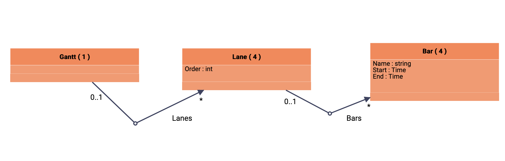

# gonggantt


## compiling and running the application

Requirements:
 - go (version >= 1.19)
 - node (version >= 18.xx)
 - vscode (>= 1.75)
 - gopls >= 0.37

```
git clone https://github.com/fullstack-lang/gonggantt
cd gonggantt
cd ng
npm i
npm install -g @angular/cli@15
ng build
cd ../go/cmd/gonggantt
go build
./gonggantt -unmarshallFromCode=stage.go -marshallOnCommit=stage 
```

## navigating to the application

with a navigator (for unknown reasons, it does not work with firefox on mac), navigate to http://localhost:8080/.

then navigate to the display of the UML diagram by clicking on the `Diagrams view` then select `New Diagram`.

You should see



## Persistance of data in go code

https://github.com/fullstack-lang/gonggantt/blob/main/go/cmd/gonggantt/gantt.go

## Persistance of the UML diagram in go code

https://github.com/fullstack-lang/gonggantt/blob/main/go/diagrams/NewDiagram.go

## Re generation of the application

You can regenerate the application

```
go install github.com/fullstack-lang/gong/go/cmd/gongc
gongc go/models
cd go/cmd/gonggantt
./gonggantt -unmarshallFromCode=stage.go -marshallOnCommit=stage 
```
