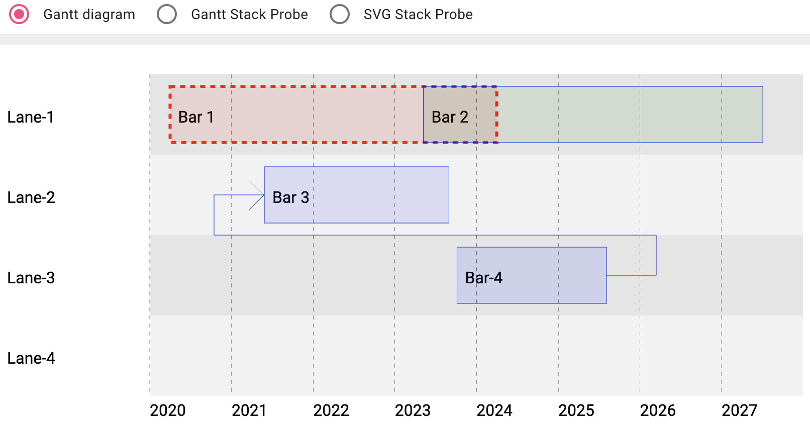

# gonggantt


## compiling and running the application

Requirements:
 - go (version >= 1.21)
 - node (version >= 18.xx)

```
git clone https://github.com/fullstack-lang/gonggantt
cd gonggantt
cd ng
npm i
ng build
cd ../go/cmd/gonggantt
go build
./gonggantt -unmarshallFromCode=gantt1.go -marshallOnCommit=gantt1 
```

## navigating to the application

navigate to http://localhost:8080/.



